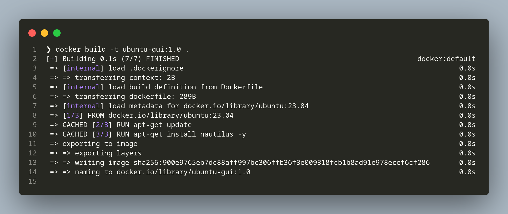

# CIE 2 TECHNIQUES

## Technique 15 : Save game

Save game is a technique of saving the state of a container as an image by commiting the container.

**STEPS**

1. List all the images
   ```docker images```

    

2. View containers
```docker container ls -a```
    

3. Run an image in interactive mode
   ```docker run -it ubuntu:23.04```

4. Update the packages of the container
   ```apt update```

5. Install a tool in the container
   ```apt install net-tools```

    


6. Verify the installation of net-tools
   ```ifconfig --version```

    

7. Exit the container
    ```exit```

8. Display list of launched containers
    ```docker ps -a```

9. Commit the Container with ID and provide name
    ```docker commit <container_id> <image_name>```

10. Verify the commit
    ```docker images```

    


The newly created image contains the ifconfig installed on it. All the changes made to the container would have been saved as an image when we commit the container

Additionally to verify the commit changes 

1.  Run the newly created image
    ```docker run -it <image_name>:<version>```

2.  Verify the installation of net-tools
    ```ifconfig --version```

    


## Technique 16 : Docker Tagging

Docker Tagging is a technique of assigning a label to a specific version of docker image

**STEPS**

1. List the images
   ```docker images```

    

2. Specify the new name to the existing image 
    ```
    docker tag <existing_image_id> <new_image_name>
    ```

3. Verify the tagged image
   
    


## Technique 20 : Injecting Files into Image using ADD

**STEPS**

1. Create a Tar File
    ```
    tar -zcvf local-folder.tar.gz ~/Downloads/local-folder
    ```

2. Append the contents to a Dockerfile
    ```
    FROM ubuntu:23.04
    RUN apt-get -y update
    ADD local-folder.tar.gz .
    ``` 

    

3. Building the Docker Image
    ```
    sudo docker build -t some-image .
    ```   

4. List the images
    ```docker images```

    

5. Running the Docker Container
    ```
    sudo docker run -it sample-image bash
    ```

6. Verifying the Extraction
    ```ls```

    


## Technique 21 : Rebuilding without cache

**STEPS**

1. Create a Docker file and append the following


2. Run the build command with --no-cache option
   
   ```docker build --no-cache .```

 


## Technique 22 : Busting the cache (Comparison of build with and without caching)

**STEPS**

1. Creating a Dockerfile that pulls some image that has already been pulled previously and update the container
    
    

2. Build the Dockerfile

    ```docker build -t cached-ubuntu:1.0 .```

    

    The above image was built in 0.1s, it cached previously ran update and install nmap

3. Now if there is a need to build an image without cache, it can be achieved by using --no-cache argument

    ```docker build --no-cache -t cached-ubuntu:2.0 .```
    
    

    The image took a while to build because it didn't cache update and install commands from RUN command

## Teqnique 23 : Intelligent Cache-Busting using Build-Args
    
**STEPS**

1. Creating a Dockerfile that has build arguments to bust the cache 

    


2. Build the image with cache bust as an argument to set different value making all the layers to rebuild.
    
    ```docker build -t ubuntu-test:2.0 --build-arg CACHEBUST=$(date +%s) .```

    `$(date +%s)` is used to ensure that each time the build command is run, unique value is generated based on date and the Image is rebuilt compulsorily

    


## Teqnique 24 : Intelligent Cache-Busting using ADD directive
    
**STEPS**

1. Creating a Dockerfile with an update command and a ADD instruction to download a file to a directory

    `ADD <Online_Link /location/to_be_downloaded_to/`

    

2. Build image from the Dockerfile

    `docker build -t ubuntu-fact:1.0 .`

    

3. Listing the images

    `docker images`

    

## Teqnique 25 : Setting the Right Time Zone in the Containers

**STEPS**

1. Create a Dockerfile with an Environment
    
    

2. Build the Dockerfile
    `docker build -t ubuntu-time-london:1.0 .`

    

3. Run the dockerfile with the command
    `docker run -e TZ=Europe/London -it ubuntu-time-london:1.0`

4. Check the date in the interactive mode
    date

5. Exit the container
    exit

    

6. Checking Local machine's and Date

    


**The Environment is running with the Time zone of London while the Local Machine is running with the Time Zone of Kolkata**


## Technique 29 : Running GUIs within Docker

**STEPS**

1. Create a Dockerfile with an Environment

    

2. Build the image
    docker build -t ubuntu-gui:1.0 .

    

3. Allow docker to access X Server to run GUI applications from docker container

    `xhost +local:docker`

4. Run the image with the command
`docker run -it --rm -e DISPLAY=$DISPLAY -v /tmp/.X11-unix:/tmp/.X11-unix ubuntu-gui:1.0` 

    


## Technique 30 : Inspecting Containers

**STEPS**

1. Run a container

    `docker run -it ubuntu-gui:1.0 bash`

2. Open another terminal and retrieve the container ID 
   
   `docker ps`

   

3. Inspect the container

    `docker inspect --size 4e1`

    


## Technique 31 : Cleanly Killing the containers

**STEPS**

1. Run a container

    `docker run -it ubuntu-gui:1.0 bash`

2. Open another terminal and retrieve the Container ID

    `docker ps`

    

3. Kill the container

    `docker kill 4e1`

    

The interactive terminal would have been exited and the docker container is killed, which can be verified by using `docker ps` command which will not list that container as running


## Technique 32 : Using Docker Machine to provision Docker Hosts 

**STEPS**

1. Install Docker Machine
https://github.com/docker/machine/releases

2. Check the version
docker-machine --version

3. Using docker-machine to run docker hosts
docker-machine ls

4. Create a Docker VM using the command
docker-machine create <vm-name>

5. Check the Virtual Box to verify the creation of VM

6. Verify the docker-machine to run docker hosts
docker-machine ls


## Technique 33 : Wildcard DNS

**STEPS**

Usage of static IP is recommended to differentiate different containers. Normally the containers take up ip-address from 172.18.0.1. If the order in which the container is run each time is differing, then each container will get different ip address differently. So, to avoid this conflict assigning static ip and referring to ip by using DNS is a recommended practice 

1. To lookup the ip-address

    `dig a "*.google.com`

    

## Technique 61 : Using DockerHub workflow

**STEPS**

1.  Create your repository on GitHub or BitBucket.

2.  Clone the new Git repository.
3.  Add code to your Git repository.
4.  Commit the source.
5.  Push the Git repository.
6.  Create a new repository on the Docker Hub.
7.  Link the Docker Hub repository to the Git repository.
8.  Wait for the Docker Hub build to complete.
9.  Commit and push a change to the source.
10. Wait for the second Docker Hub build to complete.


## Technique 66 : Running the Jenkins Master within a Docker Container

**STEPS**

1. Use the Jenkins Docker Image to install and use Jenkins Server

    `docker run -p 8080:8080 -p 50000:50000 -v jenkins_home:/var/jenkins_home jenkins/jenkins:lts-jdk11
`

2. View running Containers
    `docker ps`

3. Navigate to the link http://localhost:8080 to verify the installation of Jenkins
http://localhost:8080

    


## Technique 70 : The Docker contract: Reducing friction


## Technique 71 : Manually mirroring registry images

1. Pull the image from the hub

    `docker pull httpd`

2. View Images

    `docker images`

3. Retag the image

    `docker tag httpd:latest srikarthickk/httpd:1.0`

4. Login to docker hub in terminal using,

    `sudo docker login`

5. Push to the docker hub

    `sudo docker push srikarthickk/httpd:1.0`


## Technique 72 : Delivering Images Over Constrained Connections

**STEPS**

1. Create a Dockerfile with multiple images
   

2. Build the images respectively
    `docker build -t image1 --target img1 .`
    `docker build -t image2 --target img2 .`

    

3. Run the images in the detached mode

    `docker run -it --name image1 -d image1:latest`
    `docker run -it --name image2 -d image2:latest`

4. Inspect the bridge in the network to get the IP addresses
    `docker network inspect bridge`

5. Execute a container and ping the other
    `docker container exec -it image1 /bin/sh`

    


## Technique 73 : Sharing Docker objects as TAR files

**STEPS**

1. Export the Container with the Container name or ID
    `docker export edae > image2.tar`

2. Import the created tar file as a new Image
    `docker import - image2:2.0 < image2.tar`

3. List all the images
    `docker images`

4. Save the created image as a new Tar File
    `docker save -o image2-1.tar image2:2.0`

5. Load the Tar File
    `docker load --input image2-1.tar`

    

## Technique 74 : Informing your containers with etcd

**STEPS**

1. Check the running processes of Docker
    
    `docker ps`

2. Pull and run the etcd image to create an Etcd Container with TLS support and etcdctl

`docker run --rm -d -P --name etcd elcolio/etcd`

3. Verify the running processes of Docker
    `docker ps`

4. List all the exposed ports by etcd
    
    `docker port etcd`

5. Run the command to set a key value pair
    
    `docker exec etcd etcdctl set my_name SRI_KARTHICK`

6. Retrieve a key value pair
    
    `docker exec etcd etcdctl get my_name`

    
